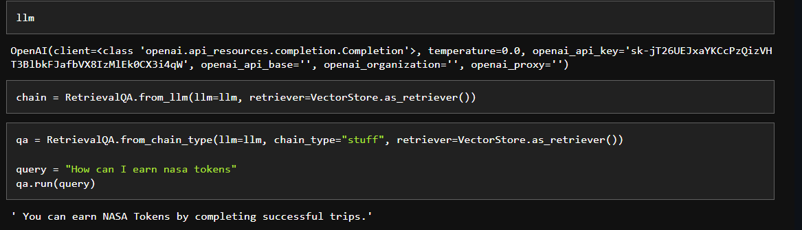

## Custom Chatbot for Nasa Webpage

This project was a small part of a bigger project for a hackathon challenge. I was part of a team of five(5), and I worked on building a custom chatbot for a webpage being built by another team member.

The process involved scraping the webpage using langchain's UnstructuredURLLoader class, splitting the document into smaller chunks and embedding them, using the FAISS class for similiarity search, and fine tuning openAI's text-davinci-003 model to create a custom chatbot.

